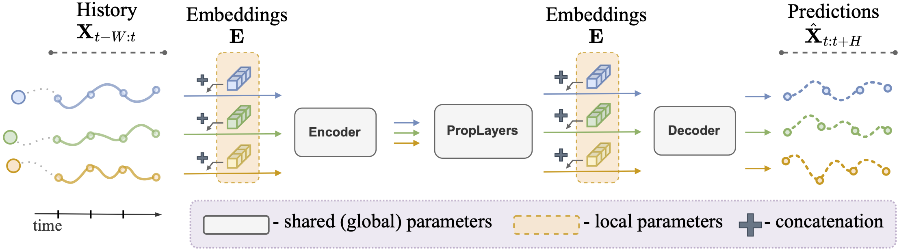

# On the Regularization of Learnable Embeddings for Time Series Forecasting (TMLR)

[](https://openreview.net/forum?id=F5ALCh3GWG)
[](https://openreview.net/pdf?id=F5ALCh3GWG)
[](https://arxiv.org/abs/2410.14630)

This repository contains the code for the reproducibility of the experiments presented in the paper "On the Regularization of Learnable Embeddings for Time Series Forecasting" (TMLR).  
Within the context of deep learning models for forecasting multiple correlated time series, we study the impact of regularization techniques when applied to the learning of time series specific (local) embeddings, used as part of a larger shared architecture.

**Authors**: [Luca Butera](mailto:luca.butera@usi.ch), Giovanni De Felice, Andrea Cini, Cesare Alippi

---

## The paper in a nutshell

In forecasting multiple time series, accounting for the individual features of each sequence can be challenging. To address this, modern deep learning methods for time series analysis combine a shared (global) model with local layers, specific to each time series, often implemented as learnable embeddings. Ideally, these local embeddings should encode meaningful representations of the unique dynamics of each sequence. However, when these are learned end-to-end as parameters of a forecasting model, they may end up acting as mere sequence identifiers. Shared processing blocks may then become reliant on such identifiers, limiting their transferability to new contexts. In this paper, we address this issue by investigating methods to regularize the learning of local learnable embeddings for time series processing. Specifically, we perform the first extensive empirical study on the subject and show how such regularizations consistently improve performance in widely adopted architectures. Furthermore, we show that methods attempting to prevent the co-adaptation of local and global parameters by means of embeddings perturbation are particularly effective in this context. 


The picture provides an overview of the considered framework. Our model's input is a window of past observations from a set of correlated time series. Its output are the corresponding forecasts for each series. We have a shared model, consisting of an encoder, a stack of processing layers, e.g., RNNs, GNNs, Attention, and a decoder. Learnable vectors of parameters (embeddings) are associated to each time series and combined in the neural architecture as shown. All parameters are learned end-to-end. We show that regularizing the learning of these embeddings, in particular by means of perturbation, leads to performance improvements and more transferable shared processing blocks. 

---

## Documentation

### Setup

The following steps require the [conda](https://docs.conda.io) package manager.  
All commands need to be executed within this file's directory.  

Install the environment by running:
```bash
conda env create -f environment.yml
```
or 
```bash
conda env create -f environment_gpu.yml
```
depending on absence or presence of gpus on your machine.  
Then activate it by running:
```bash
conda activate embreg
```

### Table 1
To reproduce the results in Table 1, run:
```bash
python main.py -cn=grid_search
```

Note that the search config file must be modified in order to produce the right combination of models and regularization, in particular note the following parameters inside "conf/grid_search.yaml":

```yaml
hydra:
  mode: MULTIRUN
  sweeper:
    params:
      seed: 1,2,3,4,5
      regularization: none,l2,dropout
      data: metrla,pemsbay,airquality
      model: time_only,message_passing,transformer
      embedding: none,standard,periodic,variational,clusterized
      model.hidden_size: 32,64,128,256
      engine.optim_kwargs.lr: 0.00025,0.00075,0.0015,0.003
```
valid combinations of embeddings and regularization are:
- none, none
- standard, none
- standard, l2
- standard, dropout
- periodic, none
- variational, none
- clusterized, none

once optimal hyperparameters are found, models can be trained on multiple seed by setting the hidden_size and lr to single values.  
Note that the code might hang for a while if the number of combinations in the config is too high, try to reduce it and run multiple configs if that is the case.  
Moreover, wandb is used by default for logging, to disable it set "override trainer/logger: dummy" in the config files.

### Table 3
To reproduce the results in Table 3, run:
```bash
python transfer.py -m -cn=transfer seed=1,2,3,4,5 dataset.target=pems3,pems4,pems7,pems8 regularization=none,l1,l2,dropout
```
and
```bash
python transfer.py -m -cn=transfer_periodic seed=1,2,3,4,5 dataset.target=pems3,pems4,pems7,pems8
```
Note that you need a wandb account for logging, or you can disable logging by setting "log_run: null" in the config files "conf/transfer.yaml" and "conf/transfer_periodic.yaml".

>If you are running the code on a mac with Apple Silicon CPU (M1, M2, ...) add "trainer.accelerator=cpu" to the previous commands, as some operations are not compatible with Apple Metal hardware acceleration.

### Experiments with fixed hyperparameters
To reproduce the other experiments run "main.py" with the following yaml config
```yaml
defaults:
  - experiment
  - override trainer/logger: wandb
  - override engine: predictor
  - override data: metrla
  - override embedding: standard
  - override regularization: none
  - _self_

hydra:
  mode: MULTIRUN
  sweeper:
    params:
      seed: 1,2,3,4,5
      data: metrla,pemsbay
      embedding: standard,periodic,variational,clusterized
      regularization: none,l2,dropout
      model: time_only,message_passing,transformer
      model.hidden_size: 64
      engine.optim_kwargs.lr: 0.00075
      embedding.module.emb_size: 8,32,128
      early_stopping.patience: 100
      trainer.max_epochs: 300
```
Note that one or more of the parameters in the list can be set at once, depending on the amount of runs to execute sequentially.
Moreover, the "embedding" and "regularization" values must be valid paris, as detailed previously.
Finally, to regularize the entire model add "hydra:sweeper:params:regularize_whole_model: true" to the config file. This is compatible only with regularization set to "dropout" or "l2".

### Additional data access
Some datasets are provided behind a direct request to the appropriate owners. 
In particular, refer to:
- This paper's authors for CLM-D dataset.
- This paper's authors for CER-E dataset, after requesting data access permission [here](https://commission.europa.eu/law/law-topic/data-protection/international-dimension-data-protection/adequacy-decisions_en)
- The authors of the original [paper](https://arxiv.org/abs/2402.10634) for EngRAD dataset. 

### Cleanup
To remove the downloaded datasets delete the folder printed by the following python script. 
```python
from pathlib import Path
from os import environ as env
print(Path(env.get("XDG_CACHE_HOME", "~/.cache")).expanduser())
```
> Double-check the folder does not contain any other important data before deleting it. We are not responsible for any data loss.

To remove the created python environment run:
```bash
conda env remove -n embreg
```

## Bibtex reference

If you find this code useful please consider citing our paper:

```
@article{butera2025regularization,
    title={On the Regularization of Learnable Embeddings for Time Series Forecasting},
    author={Luca Butera and Giovanni De Felice and Andrea Cini and Cesare Alippi},
    journal={Transactions on Machine Learning Research},
    issn={2835-8856},
    year={2025},
    url={https://openreview.net/forum?id=F5ALCh3GWG},
}
```